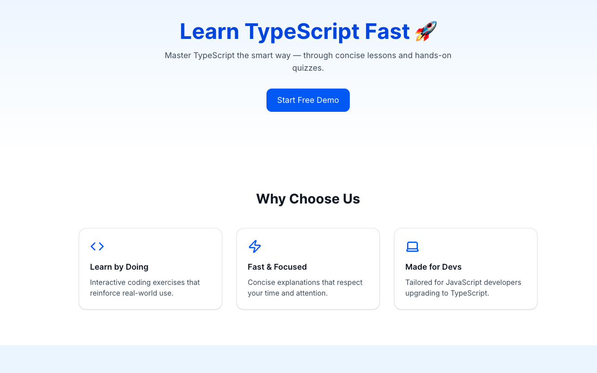

# 🚀 Learn TypeScript Fast

[](https://nextjs.org/)
[](https://www.typescriptlang.org/)
[](https://tailwindcss.com/)
[](https://lucide.dev/)
[](https://www.framer.com/motion/)
[](https://vercel.com)
[](./LICENSE)

> Learn TypeScript the modern way — through small interactive lessons built with Next.js 15, Tailwind CSS, and React Server Components.

An interactive **Next.js landing page** that helps users *master TypeScript quickly and effectively*.  
Built to demonstrate modern frontend skills — from UI design to React interactivity — in a clean, production-ready setup.


## 🌐 Live Demo
👉 [https://learntypescriptfast.vercel.app](https://learntypescriptfast.vercel.app)


## 🧩 Features

✅ **Modern Tech Stack** — built with Next.js 14 (App Router) + Tailwind CSS  
✅ **Interactive Quiz** — client-side quiz built using React hooks  
✅ **Smooth Animations** — powered by Framer Motion  
✅ **Responsive Design** — works on all screen sizes  
✅ **Clean Architecture** — modular, maintainable component structure  


## 🧠 About This Project

> “Learn TypeScript Fast” is a **frontend showcase project** designed to highlight:
> - Next.js App Router skills  
> - Interactive UI/UX thinking  
> - Modern animation & styling practices  
> - Clean, readable code  

## 📸 Preview



### 🖥️ Hero Section
Simple and bold introduction with a CTA button.

### 🧩 Features
Three animated cards that highlight the product’s benefits.

### 🧠 Interactive Quiz
A sample TypeScript multiple-choice question built with client-side state.


## ⚙️ Running Locally

Clone the project and install dependencies:

```bash
git clone https://github.com/TkRj/learn-typescript-fast.git
cd learn-typescript-fast
npm install
npm run dev
```
## 🧑‍💻 Author

<b>Tekraj Gurung</b>

🧙‍♀️ Software Engineer | London, UK

💼 [LinkedIn](https://www.linkedin.com/in/tekrajgurung/)
